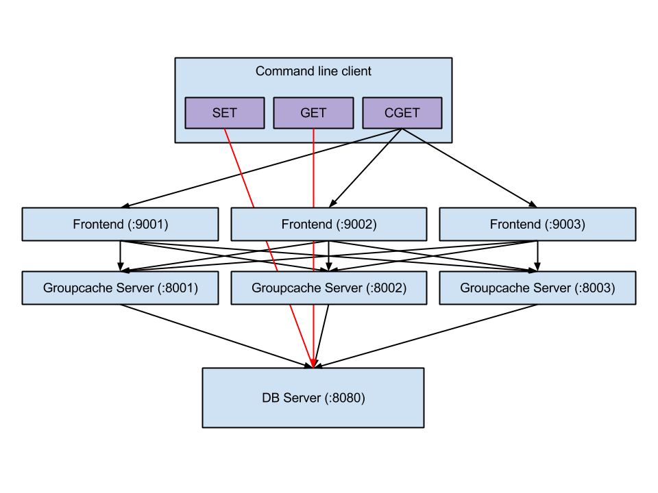
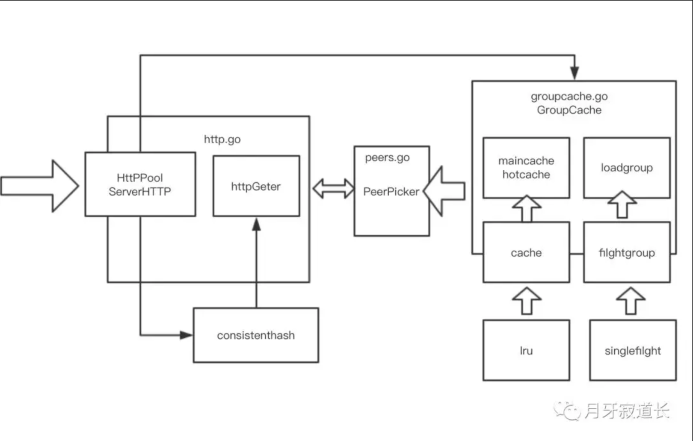

## groupcache快速入门

### 功能介绍
groupcache是go语言开发的缓存库。用于替换memcache的。
#### 客户端行为
```text
当客户端连上groupcache时，能做的只有get获取数据，如果本地有所需要的数据，则直接返回，
如果没有，则通过一致性哈希函数判断这个key所对应的peer，然后通过http从这个peer上获取数据；
如果这个peer上有需要的数据，则通过http回复给之前的那个groupcache；groupcache收到之后，保存在本地hotCache中，并返回给客户端；
如果peer上也没有所需要的数据，则groupcache从数据源(数据库或者文件)获取数据，并将数据保存在本地mainCache，并返回给客户端
```

#### 系统框架



#### 代码框架



####  制约
+ 只能get、remove，不支持update，只能remove后再get
+ 过期机制为限制cache队列长度，不能设置过期时间，只能通过内置lru淘汰过期数据；
+  经常变更的数据不适合groupcache作为缓存；
注意一点，groupcache的consistenhash实现只能增加节点，无法减少节点，若要实现该功能，要注意当减少节点时，
如果有相同的虚拟节点映射到同一个位置，则要判断删除的数量。增加不存在问题，因为增加的时候后来的虚拟节点可以替换先设置的虚拟节点，不影响使用。

### 使用入门
```shell
cd example
go build
./example -addr=:8080 -pool=http://127.0.0.1:8080 

# 查询
curl localhost:8080/color?name=green
#00FF00
curl localhost:8080/color?name=red
#FF0000

```

### 源码目录
 ```shell script
.
├── byteview.go       // 封装了字节切片的多种操作方法
├── consistenthash    // 提供了分布式一致性hash的抽象，其本身并没有实现分布式一致性的hash，而是可以以指定的hash完成分布式一致性的key的定位和节点的增加，注意这里没有实现节点删除。
├── groupcache.go     // grpc生成的代码，用于远程调用
├── groupcachepb      // 提供了上述节点之间其消息序列化和反序列化协议，基于protobuf，在groupcache.proto中定义。
├── http.go           // 实现了peers之间的http查询缓存的请求方法和响应服务
├── lru               // 实现缓存的置换算法（最近最少使用）
├── peers.go          // 抽象了缓存节点，提供了注册、获取节点的机制
├── singleflight      // 实现多个同请求的合并，保证“同时”多个同参数的get请求只执行一次操作功能
├── sinks.go          // 抽象了数据容器, 可以以不同的方法初始化设置，最终以统一的字节切片读出
└── testpb

```

### 分析目的
+ consistenthash(提供一致性哈希算法的支持)，
+ lru(提供了LRU方式清楚缓存的算法)，
+ singleflight(保证了多次相同请求只去获取值一次，减少了资源消耗)，

### 问题
+ 节点销毁怎么处理？
+ 数据更新或者删除？
    https://github.com/mailgun/groupcache


### 参考资料
+ [《groupcache 设计原理剖析 》](https://www.dazhuanlan.com/2019/12/11/5df07fcb62cae/?__cf_chl_jschl_tk__=e5a47b230d1b9d89eb3887cab036b09f2e3ea621-1590370196-0-AYcPFk14NmbUvag0bCwvLEwPGpXssbJuZhDvEpan7iZiKQi123FXqUvH-LsRSQaov7ybpQtzh-615A-1ZEDC54TuWv_6ZTwsr3zoEwubtJbUbw2J8PTOnzfviGoQB4UWA9Y1ZVzP5QLQ2BCSNlSYxDlegJsosJAV1xJQf06FNkbXPBEAh0SCE29OAzUhpZx1qOKfiUjkI1NNltnexAUoGKVMymm9ocKiWwcq4y_CnUX3xNGz6wyOTmUjQ0RrS1qcQDN8Z-0Jrzn9z1VbzCbEc8R-bdwdkzo7hqaHZ3goA0AQMpxVWxzRjbsy4YIf7vHWEg)
+ [《GROUPCACHE EXAMPLE》](https://sconedocs.github.io/groupcacheUseCase/)
+ [Playing with groupcache](https://capotej.com/blog/2013/07/28/playing-with-groupcache/)
